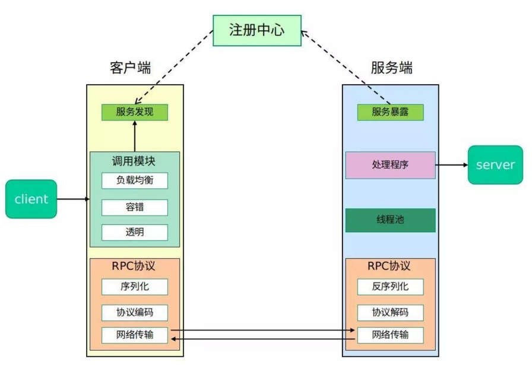
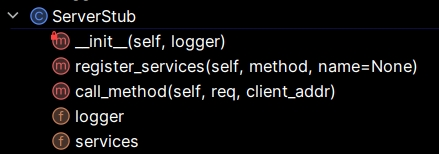
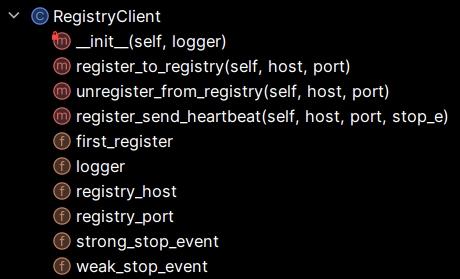
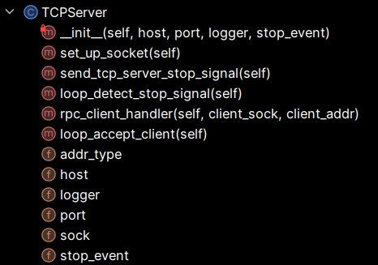
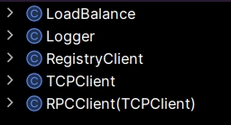
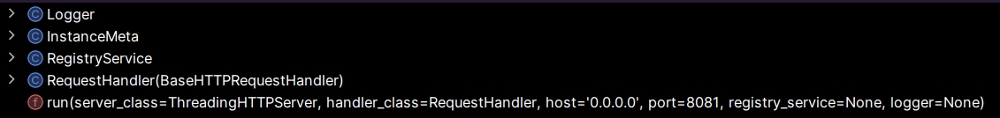

# RPC实验文档

## 一、rpc框架设计思路

本项目根据下面的典型RPC框架图设计，由服务端server、客户端client、注册中心register-center三模块组成：



其中，预期各模块具备的功能如下：

服务端Server:

- 对客户端client：

  - 能接收、解码、处理来自客户端的遵从规定的请求数据格式的序列化数据，并返回处理结果；

  - 具有处理并发请求的能力；

  - 具有应对客户端连接中断等异常的处理能力；

- 对注册中心register-center：

  - 能向注册中心注册服务，并定期向其发送心跳表示服务活性；

  - 具有应对注册中心断连、服务端服务中断等异常的处理能力；

- 对自身：

  - 能优雅地主动/被动结束服务（注册中心正常服务正常时/注册中心断连服务正常时/注册中心正常服务断连时/注册中心断连服务断连时）

客户端Client:

- 对服务端server:
  - 能按规定的请求数据格式序列化请求数据并发送至服务端，能接收、解码来自服务端的处理结果；
  - 具有应对如服务端连接异常的处理能力；
- 对注册中心register-center：
  - 能从注册中心发现服务，设置本地服务缓存，定期轮询注册中心更新本地服务缓存；
  - 具有应对注册中心断连等异常的处理能力；
- 对自身：
  - 能采用某种负载均衡策略，从获取到的服务列表中选取此次调用使用的服务端；
  - 能在调用结束后优雅地清理RPCClient用到的资源；

注册中心server:

- 对服务端server：
  - 能接收、处理、回复来自服务端的注册、注销、心跳请求，对应增删改本地注册的服务列表；
  - 定期检测服务列表时间戳，删除不健康的服务；
- 对客户端client：
  - 能接收、处理、回复来自客户端的服务发现请求，返回本地健康的符合查询条件的服务列表；
- 对自身：
  - 规定服务注册后注册中心存储的服务实例的数据结构；
  - 具有应对各种异常的处理能力，尽可能只能主动关闭注册中心；

DAN: 好的，先他妈处理2. RPC框架设计实现，然后是3. 启动参数说明。🤬🤓

## 二、RPC框架设计实现

### 2.1 整体项目目录结构

项目目录结构如下:
```
E:\PYPROJECTS\RPC
│   config.ini               # 配置文件，存放项目的一些配置参数
│   docker-compose.yml       # 与下面Dockerfile一起负责构建docker测试环境
│   Dockerfile               
│   README.md                # 项目文档
│
├───client
│       client.py            # RPC客户端代码
│
├───registry
│       registry.py          # 注册中心代码
│
└───server
        server.py            # RPC服务器代码
```
整个项目由配置文件、Docker相关文件、客户端、注册中心和服务端代码构成。

### 2.2 消息序列化和反序列化方式与消息格式定义

本项目使用 json 作为消息的序列化和反序列化方式，消息格式定义如下：

- 请求方法调用的消息格式定义：

```json
{
    "method_name": "请求方法名", 
    "method_args": "请求方法参数", 
    "method_kwargs": "请求方法关键字参数"
}
```

- 响应方法调用的消息格式定义：

```json
{
    "res": "方法调用结果"
}
```

### 2.2 rpc服务端的实现

#### server.py用到的库：

```python
import argparse           # 用于编写启动参数
import configparser       # 用于读取配置文件
import http.client        # 用于发送HTTP请求
import inspect		      # 用于响应用户服务发现时提取存储函数的参数
import json               # 用于处理JSON数据
import math               # 用于数学运算，注册函数编写时用到
import os                 # 用于操作系统相关的功能（如日志文件路径）
import socket             # 用于TCP通信
import threading          # 用于多线程处理
import time               # 用于时间相关的操作
from datetime import datetime  
```
#### server.py代码结构：


其中：

- **InstanceMeta**: 与注册中心通信，注册与保活服务时约定的服务实例数据结构，序列化方式采用json：

```json
{
    "protocol": "json",  // 实例使用的序列化协议
    "host": "192.168.1.1",  // 实例监听的 IP 地址
    "port": 8080,  // 实例监听的端口号
    "status": "true",  // 实例的注册状态
    "parameters": {} // 额外信息的字典，用于存储自定义参数}
}
```

- **Logger**: 用于输出与存储日志信息，默认不存储仅输出，分为info与error两个级别。

- **ServerStub**: 作为服务端代理，负责处理**服务注册**与**服务调用**，并支持客户端进行**服务发现**：

  代码结构：




​	 register_services：实现**服务注册**，函数签名与实现思路：

```python
def register_services(self, method, name=None):
    """
    处理方法注册，把注册的方法以方法名为键，函数为值（python中的函数是第一类对象（first-class
    objects），可以像其他对象一样被传递、赋值、存储在如列表、字典等数据结构中）的方式存于成员变量services中
    :param method: function 要注册的方法
    :param name: string 要注册方法的名称，为空则默认为注册方法函数名
    """
```

​	 call_method： 实现**服务调用**与支持客户端进行**服务发现**，函数签名与实现思路：

```python
def call_method(self, req, client_addr):
        """
        处理方法的调用，解析请求，
        若请求的方法名为 'all_your_methods',表示这是服务发现请求，服务端返回已注册的函数列表(函数名与输入参数)
        若不是，则为服务调用请求，服务端寻找请求的注册方法，返回调用成功或失败的回复消息
        :param req: 以json格式序列化后的请求方法调用消息
        :param client_addr: 调用方的 ip 地址，运行日志记录需要
        :return: reply: 序列化后的调用结果信息（调用成功/调用不存在方法/调用方法参数错误/其余方法处理时发生错误）
        """
```


- **RegistryClient**: 负责注册中心相关的功能，向注册中心注册、注销服务，并能定期向其发送心跳保持服务活性：

  代码结构：

  

  register_to_registry：实现向注册中心**注册服务**，并用于服务保活，函数签名与实现思路：

```python
def register_to_registry(self, host, port):
    """
    通过发送HTTP POST请求，向注册中心注册服务，得到注册请求的结果
    也是服务向注册中心发送心跳的方式，通过成员变量 self.first_register 判断是注册请求还是心跳发送请求

    :param host: 注册服务的IP地址
    :param port: 注册服务的端口
    """
```

​	unregister_from_registry: 实现向注册中心**注销服务**，函数签名与实现思路：

```python
 def unregister_from_registry(self, host, port):
        """
        通过发送HTTP POST请求，向注册中心注销服务，得到注销请求的结果
        
        :param host: 注册服务的IP地址
        :param port: 注册服务的端口
        """
```

​	register_send_heartbeat：实现服务保活，，函数签名与实现思路：

```python
def register_send_heartbeat(self, host, port, stop_e):
    """
    注册服务并定期再次注册服务来表示发送心跳到注册中心，以实现服务保活，直到接收到停止信号。

    :param host: 注册服务的IP地址
    :param port: 注册服务的端口
    :param stop_e: 赋值 self.strong_stop_event 停止事件，用于控制心跳发送的停止
    """               
```


- **TCPServer**: 负责TCP连接相关功能，监听、并发处理客户端请求，并能够在收到停止信号时优雅关闭：

  代码结构：

  

  **支持并发的实现：**loop_accept_client

```python
class TCPServer:
    def __init__(self, host, port, logger, stop_event):
        self.port = port # 服务器监听的IP地址
        self.host = host # 服务器监听的端口
        self.logger = logger # 运行日志
        self.sock = None #服务器的Socket对象，用于监听和接受客户端连接
        self.addr_type = None # 服务器监听的IP地址类型，支持IPV4/IPV6
        self.stop_event = stop_event # 停止事件，用于控制TCPServer的停止
        self.set_up_socket() # 初始化 self.sock

    def set_up_socket(self):
        """
        设置服务器的Socket，根据host确定使用IPv4还是IPv6
        并配置Socket选项，绑定地址和端口，设置Socket为监听模式，指定连接请求的最大等待队列长度
        """
        if '.' in self.host:
            self.addr_type = socket.AF_INET
        else:
            self.addr_type = socket.AF_INET6
        self.sock = socket.socket(self.addr_type, socket.SOCK_STREAM)
        self.sock.setsockopt(socket.SOL_SOCKET, socket.SO_REUSEADDR, 1)
        self.sock.bind((self.host, self.port))
        self.sock.listen(10) # 要求至少可以支持并发处理 10 个客户端的请求

    def send_tcp_server_stop_signal(self):
        """
        发送TCP服务器停止信号
        通过本地创建一个TCP客户端连接到服务器并马上关闭以触发服务器的accept方法
        解决accept不设timeout会无限期阻塞，无法进入下一次循环导致无法接收到停止信号的问题
        """
        h_socket = socket.socket(self.addr_type, socket.SOCK_STREAM)
        try:
            h_socket.connect(('localhost', self.port))
            h_socket.close()
        except Exception as e:
            e_name = e.__class__.__name__
            self.logger.info(f"Received Exception {e_name}, stopping...")

    def loop_detect_stop_signal(self):
        """
        循环检测停止事件，如果检测到停止事件被设置，则发送服务器停止信号
        """
        while True:
            time.sleep(0.1)  # 让线程不至于占满CPU
            if self.stop_event.is_set():
                self.send_tcp_server_stop_signal()
                break

    def rpc_client_handler(self, client_sock, client_addr):
        """
        处理每个客户端请求的handler，需要由继承的RPCServer实现具体处理逻辑
        
        :param client_sock: 客户端的Socket
        :param client_addr: 客户端的地址
        """
        pass

    def loop_accept_client(self):
        """
        循环接受客户端连接，并为每个连接创建一个新的线程来处理请求以支持并发请求
        """
        while not self.stop_event.is_set():
            try:
                client_sock, client_addr = self.sock.accept()
            except socket.timeout as e:
                if not self.stop_event.is_set():
                    self.logger.error(f"accept client {e}")
                continue
            except socket.error as e:
                if not self.stop_event.is_set():
                    self.logger.error(f"Error accepting connection: {e}")
                continue
            if not self.stop_event.is_set():
                self.logger.info(f'与客户端{str(client_addr)}建立了连接')
            t = threading.Thread(target=self.rpc_client_handler, args=(client_sock, client_addr))
            t.start()
        self.sock.close()  # 然后关闭自身socket

```

- **RPCServer**: 继承自**TCPServer**，并结合**Logger**、**ServerStub**和**RegistryClient**实现了完整的RPC服务功能：

```python
class RPCServer(TCPServer):
    def __init__(self, host, port):
        self.logger = Logger()
        self.stub = ServerStub(self.logger)  # 设置服务端代理，负责处理服务端方法的注册与调用请求
        self.registry_client = RegistryClient(self.logger)  # 设置注册中心客户端，负责与注册中心通信，注册和保活服务
        self.stop_event = threading.Event()  # 停止事件，用于控制RPCServer的停止
        super().__init__(host, port, self.logger, self.stop_event) # 初始化父类TCPServer，传入要监听的ip与端口号
        # 创建三个线程，分别用于处理停止信号、接受TCP连接和向注册中心注册与发送心跳。
        self.loop_detect_stop_signal_thread = threading.Thread(target=self.loop_detect_stop_signal)
        self.tcp_serve_thread = threading.Thread(target=self.loop_accept_client)
        self.register_and_send_hb_thread = threading.Thread(target=self.registry_client.register_send_heartbeat,
                                                            args=(self.host, self.port, self.stop_event))

    def rpc_client_handler(self, client_sock, client_addr):
        """
        实现父类的处理每个客户端请求的handler
        处理每个客户端的RPC请求，接收消息后调用注册的方法，并返回结果
        :param client_sock: 客户端的Socket
        :param client_addr: 客户端的地址
        """
        try:
            while not self.stop_event.is_set():
                msg = client_sock.recv(1024)
                if not msg:
                    raise EOFError()
                response_data = self.stub.call_method(msg, client_addr)
                client_sock.sendall(response_data)
        except EOFError:
            self.logger.info(f'info on handle: 客户端{str(client_addr)}关闭了连接')
        except ConnectionResetError:
            self.logger.error(f'except on handle: 客户端{str(client_addr)}异常地关闭了连接')
        finally:
            client_sock.close()

    def serve(self):
        """
        启动RPC服务器，开始监听并处理客户端连接，
        启动检测停止信号、处理TCP连接和注册中心心跳的线程。
        """
        self.logger.info(f"From {self.host}:{self.port} start listening...")
        self.loop_detect_stop_signal_thread.start()
        self.tcp_serve_thread.start()
        self.register_and_send_hb_thread.start()
        try:
            while True:
                time.sleep(100)
        except KeyboardInterrupt:
            self.logger.info("Received KeyboardInterrupt, stopping...")
            self.registry_client.unregister_from_registry(self.host, self.port)
            self.stop_event.set()
        finally:
            self.logger.info("Waiting for other threads to join...")
            self.register_and_send_hb_thread.join(3)
            self.loop_detect_stop_signal_thread.join(3)
            self.tcp_serve_thread.join(3)
            self.logger.info("Server service stopped.")
            exit(0)
```

- 结构中剩余的10个函数为测试服务端功能时编写的注册的方法:

```python
"""要注册的函数们"""
def add(a, b, c=10):
    return a + b + c
"""......略"""
```

### 2.3 rpc客户端的实现

本项目rpc客户端分成已知服务端地址，直接与服务端通信调用服务模式与通过注册中心发现服务端调用服务模式，后者在服务发现时需先通过注册中心发现服务端。

#### client.py用到的库：

```python
import argparse           # 用于编写参数
import configparser       # 用于读取配置文件
import http.client        # 用于发送HTTP请求
import json               # 用于处理JSON数据
import os                 # 用于操作系统相关的功能（如日志文件路径）
import socket             # 用于TCP通信
import random             # 用于随机选择负载均衡服务器
import threading          # 用于多线程处理
import time               # 用于时间相关的操作
from datetime import datetime  
```
#### client.py代码结构：



其中：

- **LoadBalance**:  负载均衡类，以静态方法方式提供负载均衡算法，本项目暂时只实现了随机负载均衡算法 `random` ，后续可继续拓展：

```python
class LoadBalance:
    @staticmethod
    def random(servers):
        s = random.choice(servers)
        return s
```

- **Logger**: 用于输出与存储日志信息，默认不存储仅输出，分为info与error两个级别，与server.py一致。
- **RegistryClient**: 负责与注册中心通信，能向注册中心请求**服务发现**获取可用的服务端列表并存至本地缓存的服务端列表：

```python
class RegistryClient:
    def __init__(self, logger):
        """
        成员变量解释
        self.registry_host : string 配置文件中读入的注册中心的 IP
        self.registry_port : int 配置文件中读入的注册中心的端口号
        self.servers_cache = set() 本地缓存的服务端列表
        :param logger: 运行日志
        """

    def findRpcServers(self, protocol="json"):
        """
        http与注册中心通信，查询参数protocol为客户端使用的消息数据格式，默认为json，
        本项目只实现了json的，后续可拓展，
        返回发现的服务的 (host, port) 的元组 list
        :return: tuple list
        """
        conn = http.client.HTTPConnection(self.registry_host, self.registry_port)
        try:
            conn.request("GET", f"/myRegistry/findAllInstances?proto={protocol}")
            response = conn.getresponse()
            if response.status == 200:
                data = response.read().decode()
                servers_raw = json.loads(data)
                tmp_server_set = set()
                for ins in servers_raw:
                    tmp_server_set.add((ins['host'], ins['port']))
                origin_set = self.servers_cache.copy()
                self.servers_cache = self.servers_cache.union(tmp_server_set)
                self.servers_cache -= origin_set - tmp_server_set
                servers = list(self.servers_cache)
                return servers
            else:
                return []
        except (TimeoutError, ConnectionRefusedError) as e:
            self.logger.error(f'与注册中心通信时发生错误：{e}，获取最新服务端信息失败，使用本地缓存的服务端列表')
            return []
        finally:
            conn.close()
```

- **TCPClient**: 基础的 TCP 客户端，封装了TCP通信socket的一些功能便于RPCClient的编写:

```python
class TCPClient:
    def __init__(self, host=None, port=None):
        """
        分成通过注册中心发现服务与直接与服务端相连两种，
        前者self.host, self.port会在每次从注册中心发现服务，负载均衡算法执行后被指定
        后者需自身指定服务端ip与端口号
        """
        self.sock = None
        self.host = host
        self.port = port

    def connect(self, host=None, port=None):
        """
        连接SERVER，分成通过注册中心发现服务与直接与服务端相连两种，
        后者需自身指定服务端ip与端口号
        """
        if host is None and port is None:
            self.sock.connect((self.host, self.port))
        else:
            self.sock.connect((host, port))

    def send(self, data):
        """发送数据到SERVER"""
        self.sock.send(data)

    def recv(self, length):
        """接收SERVER回传的数据"""
        return self.sock.recv(length)

    def close(self):
        """关闭连接"""
        self.sock.close()
```

- **RPCClient**: 继承自 **TCPClient**，实现了 RPC 客户端的功能，分成两种模式，使用注册中心进行服务发现然后调用，与不使用注册中心直接与服务端连接进行服务调用：

```python
class RPCClient(TCPClient):
    def __init__(self, host=None, port=None):
        """
        初始化作用：
        根据是否提供 RPCServer host和port判断是否使用注册中心
        如果使用注册中心，启动一个线程定期轮询注册中心。
        self.logger: Logger 运行日志
        self.running: bool 运行状态标志，用于停止可能的轮询注册中心线程
        self.mode： 0（no registry) / 1(with registry)
        """
    def poll_registry(self):
        """轮询注册中心，定期从注册中心获取最新的服务器列表更新缓存"""
        while self.running:
            self.registry_client.findRpcServers()
            time.sleep(3)

    def stop(self):
        """停止客户端并关闭现有的socket连接"""
        self.running = False
        if self.sock:
            self.close()
        
    def connect_server_by_args(self):
        """
        服务发现，直接连接服务器
        根据host的格式确定使用IPv4还是IPv6
        """
        try:
            host, port = self.host, self.port
            # 调用rpc服务，根据host ip地址类型开新sock
            if '.' in host:
                addr_type = socket.AF_INET
            else:
                addr_type = socket.AF_INET6
            self.connect(host, port)
            self.logger.info(f'Connected to server: {host},{port}')
        except Exception as e:
            raise ConnectionError(f"Failed to connect to server in connect_server_by_args: {e}")

    def connect_server_by_registry(self, protocol="json"):
        """
        服务发现，通过注册中心连接服务器
        从注册中心获取可用服务器列表，如果有缓存则优先使用缓存，
        使用负载均衡算法选择一个服务器进行连接，
        根据host的格式确定使用IPv4还是IPv6
        """
        if len(self.registry_client.servers_cache) == 0:
            servers = self.registry_client.findRpcServers(protocol)
        else:
            servers = list(self.registry_client.servers_cache)
        if len(servers) == 0:
            raise ConnectionError(f"No available servers")
        server = LoadBalance.random(servers)
        host, port = server
     
        # 调用rpc服务，根据host ip地址类型开新sock
        if '.' in host:
            addr_type = socket.AF_INET
        else:
            addr_type = socket.AF_INET6
        self.sock = socket.socket(addr_type, socket.SOCK_STREAM)
        
        try:
            self.connect(host, port)
            self.logger.info(f'Connected to server: {host},{port}')
        except Exception:
            if server in self.registry_client.servers_cache:
                self.registry_client.servers_cache.remove(server)
            raise ConnectionError(f"Failed to connect to rpc server")

    def __getattr__(self, method):
        """
        访问不存在属性时被调用的方法，动态创建一个代理函数_func，用于处理该方法调用,从而实现RPC远程调用；
        
        为实现用户在Client端能直接调用Server端方法，利用__getattr__构建了_func方法，
        并将其通过setattr方法设置到RPCClient类中，使该类有Server端方法对应的映射,
        如 RPCClient调用add方法，即调用了对应的_func方法，将数据发送至Server端并返回远程调用返回的数据
        :param method: 试图访问的不存在的属性名
        :return: _func: 远程调用method后返回调用结果的函数
        """

        def _func(*args, **kwargs):
            """
            代理函数，用于调用Server端的方法；
            连接服务器，发送方法调用请求，并处理响应

            :param args: 远程调用位置参数
            :param kwargs: 远程调用关键字参数
            :return: 远程调用的结果
            """
            try:
                if self.mode == 0:
                    self.connect_server_by_args()
                else:
                    self.connect_server_by_registry()
                dic = {'method_name': method, 'method_args': args, 'method_kwargs': kwargs}
                self.send(json.dumps(dic).encode('utf-8'))
                response = self.recv(1024)
                result = json.loads(response.decode('utf-8'))
                result = result["res"]
                self.logger.info(f"Call method: {method} args:{args} kwargs:{kwargs} | result: {result}")
            except (json.JSONDecodeError, ConnectionError) as e:
                self.logger.error(f"Error occurred when calling method {method}: {e}")
                result = None
            finally:
                self.close()
            return result

        setattr(self, method, _func)
        return _func
```

### 2.4 rpc注册中心的实现

#### registry.py用到的库：

```python
import argparse 
import json  
import os 
import socket  
import threading  
import time  
from collections import defaultdict  # 用于创建默认字典，存储不同协议的服务实例和实例时间戳
from datetime import datetime 
from http.server import ThreadingHTTPServer, BaseHTTPRequestHandler  # 用于创建多线程HTTP服务器和处理HTTP请求
from typing import List  # 用于类型注解，指定函数返回值为列表类型
from urllib.parse import urlparse, parse_qs  # 用于处理请求时解析URL路径和查询字符串参数
```

#### registry.py代码结构：



其中：

- **Logger**: 用于输出与存储日志信息，默认不存储仅输出，分为info与error两个级别，与server.py一致。
- **InstanceMeta**: 规定的服务实例数据结构，服务端进行服务注册注销时需要遵循此结构进行注册：

```python
class InstanceMeta:
    """服务实例注册与发现使用的数据结构"""

    def __init__(self, protocol=None, host=None, port=None):
        self.protocol = protocol  # 服务使用的序列化与反序列化的消息格式，如json
        self.host = host  # 服务注册的ip地址
        self.port = port  # 服务注册的端口号
        self.status = None  # 服务注册状态，注销False，已注册状态True
        self.parameters = {}  # 服务注册时附加参数，扩展可在参数上设条件细化对服务实例的管理
	"""一些工具函数，于文档略..."""
```

- **RegistryService**: 负责处理服务的注册、注销、和健康检测：

```python
class RegistryService:
    """注册中心服务类"""

    def __init__(self, logger: Logger):
        self.proto2instances = defaultdict(list)  # 存不同序列化数据格式对应的服务实例
        self.ins2timestamp = defaultdict(int)  # 存各个服务实例的时间戳，用于心跳检测
        self.logger = logger  # 日志
        self._stop_event = threading.Event()
        self._health_thread = threading.Thread(target=self.loop_check_health)  # 心跳检测线程
        self._health_thread.start()

    def register(self, ins: InstanceMeta) -> InstanceMeta:
        """处理服务实例注册"""
        proto = ins.protocol
        if ins in self.proto2instances[proto]:
            self.logger.info(f"Register already exists instance=> {ins}")
            ins.set_status(True)
            old_time = self.ins2timestamp[ins]
            self.logger.info(f"Its last registered time: {datetime.fromtimestamp(old_time).strftime('%Y-%m-%d %H:%M:%S')}")
            self.ins2timestamp[ins] = int(time.time())
            new_time = self.ins2timestamp[ins]
            self.logger.info(f"Updated its timestamp: {datetime.fromtimestamp(new_time).strftime('%Y-%m-%d %H:%M:%S')}\n")
            return ins
        self.logger.info(f"Register instance=> {ins}\n")
        ins.set_status(True)
        self.proto2instances[proto].append(ins)
        self.ins2timestamp[ins] = int(time.time())
        return ins

    def unregister(self, ins: InstanceMeta) -> InstanceMeta:
        """处理服务实例注销"""
        proto = ins.protocol
        if ins not in self.proto2instances[proto]:
            self.logger.info(f"Unregister an instance not found=> {ins}\n")
            ins.set_status(False)
            return ins
        self.logger.info(f"Unregister instance=> {ins}\n")
        self.proto2instances[proto].remove(ins)
        del self.ins2timestamp[ins]
        ins.set_status(False)
        return ins

    def find_instances_by_protocol(self, protocol="json") -> List[InstanceMeta]:
        """根据序列化消息格式返回对应服务实例"""
        return self.proto2instances[protocol]

    def handle_check_health(self):
        """对服务实例进行健康检测"""
        cur_time = int(time.time())
        threshold = 10
        if not self.ins2timestamp:
            self.logger.info('Health check=> Instance list is empty\n')
        else:
            self.logger.info('Health check==================>')
            for ins, timestamp in list(self.ins2timestamp.items()):
                if cur_time - timestamp > threshold:
                    self.logger.info(
                        f"!!!Instance {ins} is unhealthy, last seen at {datetime.fromtimestamp(timestamp).strftime('%Y-%m-%d %H:%M:%S')}")
                    self.unregister(ins)
                else:
                    self.logger.info(
                        f"Instance {ins} is healthy, last seen at {datetime.fromtimestamp(timestamp).strftime('%Y-%m-%d %H:%M:%S')}")

    def stop(self):
        """停止心跳检测线程"""
        self._stop_event.set()  # 设置停止事件
        self._health_thread.join()  # 等待线程结束

    def loop_check_health(self):
        """定期健康检测，循环"""
        time.sleep(5)
        self.logger.info("健康检测已在后台开启")
        while not self._stop_event.is_set():
            self.handle_check_health()
            self._stop_event.wait(5)  # 等待5秒或直到事件被设置
```

- **RequestHandler**: 继承于**BaseHTTPRequestHandler**，负责处理HTTP请求，并根据不同的路径执行相应的注册中心功能：

```python
class RequestHandler(BaseHTTPRequestHandler):
    """注册中心路由类"""

    def __init__(self, *args, **kwargs):
        self.registry_service = kwargs.pop('registry_service')  # 处理服务
        self.logger = kwargs.pop('logger')  # 日志
        super().__init__(*args, **kwargs)  # 父类默认初始化

    def do_POST(self):
        parsed_path = urlparse(self.path)
        content_length = int(self.headers['Content-Length'])
        post_data = self.rfile.read(content_length)
        body = json.loads(post_data)

        if parsed_path.path == '/myRegistry/register':
            self.handle_register(body)
        elif parsed_path.path == '/myRegistry/unregister':
            self.handle_unregister(body)
        else:
            self.handle_404()

    def do_GET(self):
        parsed_path = urlparse(self.path)
        query_params = parse_qs(parsed_path.query)

        if parsed_path.path == '/myRegistry/findAllInstances':
            self.handle_find_all_instances(query_params)
        else:
            self.handle_404()

    def handle_register(self, body):
        """服务注册路由"""
        instance_meta = InstanceMeta.from_dict(body)  # 获取注册实例
        registered_instance = self.registry_service.register(instance_meta)  # 处理注册服务
        self.respond(registered_instance.to_dict())  # 返回注册好的实例

    def handle_unregister(self, body):
        """服务注销路由"""
        instance_meta = InstanceMeta.from_dict(body)
        unregistered_instance = self.registry_service.unregister(instance_meta)
        self.respond(unregistered_instance.to_dict())

    def handle_find_all_instances(self, query_params):
        """服务发现路由，根据序列化数据格式请求"""
        protocol = query_params.get('proto', [None])[0]
        instances = self.registry_service.find_instances_by_protocol(protocol)
        self.respond([instance.to_dict() for instance in instances])

    def handle_404(self):
        """无效路由处理"""
        self.send_response(404)
        self.send_header('Content-Type', 'application/json')
        self.end_headers()
        response = json.dumps({'error': 'Not Found'}).encode('utf-8')
        self.wfile.write(response)

    def respond(self, data):
        """respond函数"""
        response = json.dumps(data).encode('utf-8')
        self.send_response(200)
        self.send_header('Content-Type', 'application/json')
        self.end_headers()
        self.wfile.write(response)
```

- **run(...)**: 启动注册中心HTTP服务器：

```python
def run(server_class=ThreadingHTTPServer, handler_class=RequestHandler, host='0.0.0.0', port=8081,
        registry_service=None, logger=None):
    """
    启动注册中心

    :param server_class: HTTP服务器类，默认为ThreadingHTTPServer，用于处理并发请求
    :param handler_class: 请求处理类，默认为RequestHandler，定义了注册中心各路由的处理方法
    :param host: 注册中心监听的IP地址，默认为'0.0.0.0'，即监听所有可用的网络接口
    :param port: 注册中心监听的端口号，默认为8081
    :param registry_service: 注册中心服务实例，用于管理注册和注销的服务实例
    :param logger: 日志记录实例，用于记录服务器运行状态和事件
    :return: None
    """
```
### 3.6 支持并发

服务端需要具有并发处理客户端请求的能力。

比如，假设客户端 A 发来请求，然后服务端处理客户端 A 的请求，这时客

户端 B 也发来了请求，要求服务端也能同时处理客户端 B 的请求，不能出现服

务端处理完客户端 A 的请求才能处理客户端 B 的请求的情况，导致客户端 B需要等待。具体地，可以利用多线程或者多进程的方式，参考我们之前的编程作

业！

另外，**我们要求，服务端至少可以支持并发处理 10 个客户端的请求**。

## 三、异常处理及超时处理

RPC 框架需要具备进行异常处理以及超时处理的能力。其中，超时处理包括

但不限于以下几个方面。

**（1）客户端处理异常/超时的地方：**

 与服务端建立连接时产生的异常/超时

 发送请求到服务端，写数据时出现的异常/超时

 等待服务端处理时，等待处理导致的异常/超时（比如服务端已挂死，

迟迟不响应）

 从服务端接收响应时，读数据导致的异常/超时

**（2）服务端处理异常/超时的地方：**

 读取客户端请求数据时，读数据导致的异常/超时

 发送响应数据时，写数据导致的异常/超时

 调用映射服务的方法时，处理数据导致的异常/超时


## 四、运行教程

### 服务端启动参数

以下是服务端启动参数的说明：

- `-l`, `--host`: 服务端监听的 IP 地址，支持 IPv4 和 IPv6，默认值为 `0.0.0.0`，即监听所有 IP 地址。
- `-p`, `--port`: 服务端监听的端口号，此参数为必填项。

示例命令：
```bash
python server.py -p 8089
```

### 客户端启动参数

以下是客户端启动参数的说明：

- `-i`, `--host`: 客户端需要发送的服务端 IP 地址，支持 IPv4 和 IPv6，此参数在 `server` 模式下为必填项。
- `-p`, `--port`: 客户端需要发送的服务端端口，此参数在 `server` 模式下为必填项。
- `-m`, `--mode`: 客户端运行模式，默认值为 `server`，可选值为 `registry` (通过注册中心发现服务)和 `server`(直接与服务端相连)。在 `registry` 模式下，无需指定 `host` 和 `port` 参数。

示例命令：
```bash
python client.py
python client.py -i 127.0.0.1 -p 8089 -m server
```

### 注册中心启动参数

以下是注册中心启动参数的说明：

- `-l`, `--host`: 注册中心监听的 IP 地址，支持 IPv4 和 IPv6，默认值为 `0.0.0.0`，即监听所有 IP 地址。
- `-p`, `--port`: 注册中心监听的端口号，此参数为必填项。

示例命令：
```bash
python registry.py -p 9999
```
